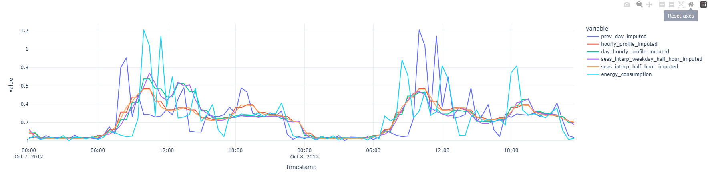
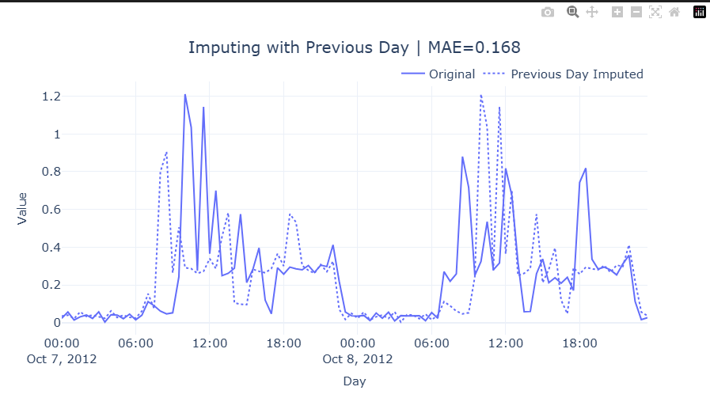

# SW 01 Exercises Solutions

## Part 1: Reflect on the data generation process of 2-3 time series datasets

### Dataset 1: Swiss Transport Real-Time Data (opentransportdata.swiss)

Source: [SBB  actual journey data from opentransportdata.swiss](https://data.opentransportdata.swiss/dataset/istdaten)

Data Collection Process: 
- Time Interval: Daily data collection capturing journeys completed during each day
- Time Range: Continuous collection with historical archives available, starting from 2016 up to the present
- Collection Method: Real-time data from customer information systems, combining actual operational data with last received forecasts when real-time information is unavailable

Influencing Factors/Laws:
- Weather conditions, technical disruptions, maintenance schedules, passenger volume
- Infrastructure: Hub station complexities that create cascading delays
- Seasonal Patterns: Tourist seasons, commuter patterns, holiday schedules

Expected Patterns:
- Daily Cycles: Morning and evening rush hour peaks
- Weekly Patterns: More delays during weekdays
- Seasonal Trends: More weather-related delays in winter
- Peaks during holidays and special events

### Dataset 2: Household Energy Consumption (Kaggle)

Source: [Household Electric Power Consumption dataset on Kaggle](https://www.kaggle.com/datasets/uciml/electric-power-consumption-data-set)

Data Collection Process: 
- Time Interval: One-minute intervals with some missing days
- Time Range: December 2006 to November 2010 (47 months)
- Collection Method: Smart meter data collection from one household, measuring various electrical parameters (active/reactive power, voltage, current, sub-metering)

Influencing Factors/Laws:
- Environmental: Temperature, daylight hours, seasonal changes
- Economic: Energy prices, efficiency incentives, tariffs
- Technological: Appliance efficiency, home automation systems, renewable energy (for example solar panels with battery storage)

Expected Patterns:
- Daily Cycles: Morning and evening consumption peaks, nighttime lows
- Weekly Patterns: Different weekday vs. weekend usage profiles
- Seasonal Trends: Heating (wither) and cooling (summer) demands, increased lighting needs in winter, more outdoor activities in summer
- Long-term trends: Adoption of energy-efficient appliances, changes in household size or behavior

# Part 2 Modern Time Series Forecasting Analysis 

energy consumption data over a two-day period

The data is moderately noisy. This is because it shows a clear temporal trend with overall consumption rising and then falling during the day with a small spike at 18:00 and being almost none during the night. During the day, the different imputation techniques show very different spikes.

So the most prominent pattern is a clear daily cycle

When we compare the consumption of today with the one from yesterday, we can see that the spikes vary alot which tells us, that the data is quite noisy but during the night its stable.

## Different Imputation strategies
hourly_profile captures the broad trend of low consumption at night and higher consumption during the day but misses the sharp peaks and volatility of the actual data. This approach is very generalized and therefore loses critical details but it's good to get a general feel for the trends.

prev_day_imputed copies the previous day's pattern. it gives us a good feelfor a realistic daily structure with peaks and troughs, it fails to account for day-to-day variability.

comparing **original data** to data imputed using a **"previous day" method**.
The data is quite noisy due to the sharp spikes. The previous day imputed is also far off during the spikes which shows inconsistency during these times. 

There are probably some "day of the week" effects because the spikes from the previous days look very different. The "calm" times look very similar though

The 7.10.2012 was a sunday so it's understandable, that the energy consumption is higher in the morning than on monday because the dataset we're reading from is the "London Smart Meters" which captures the energy consumption of households and on sundays there are more people at home than on mondays. The spike on monday 18:00 also nicely shows when the people come home from work

